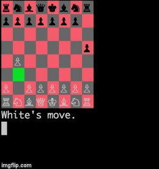

# Chess

Console-based chess game made using Ruby.

### Instructions

* Clone repo onto local machine
* Install colorize gem with command: gem install colorize
* Run game with command: ruby game.rb
* Arrow keys to move and spacebar to select

### Gameplay

